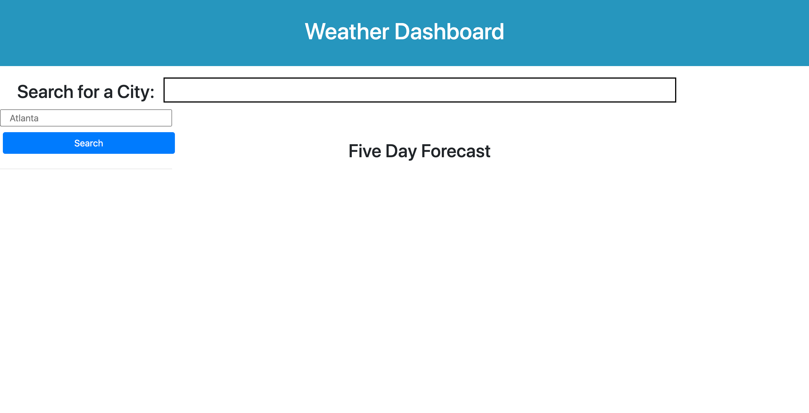
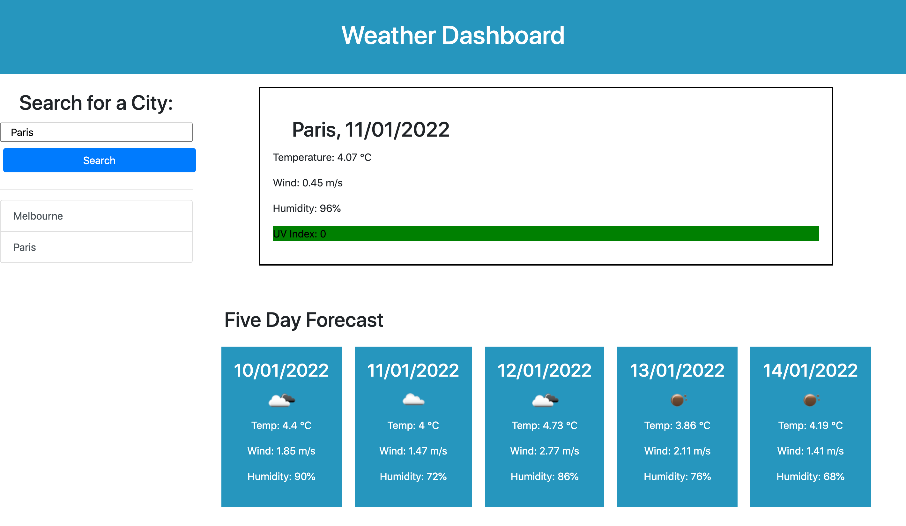
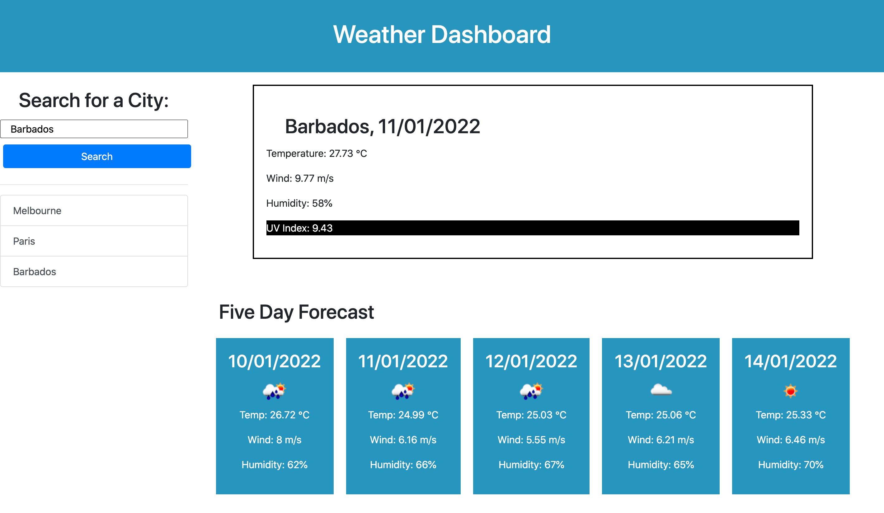

# Weather Dashboard

The project is a weather dashboard, created using HTML, Javascript and CSS. The weather dashboard displays data retrieved through the Open Weather API.

The project:

<li> allows the user to search for a city, by entering it into a search input </li>
<li> displays the current weather conditions (temperature, wind speed, humidity and UV index) for that city </li>
</li>displays a five day forecast for that city. Users can view the date, temperature, humidity and wind speed. </li>
<li> presents users with the current UV index reading in their searched city, and displays the value in a different colour depending on the value, giving a visual representation of the danger </li>
<li> saves the user's searches using localStorage, and adds them to a list of past searches which is rendered onto the site </li>
<li> allows the users to click on past searches to quickly retrieve current and future weather data from cities they had previously searched for </li>

The dashboard was styled with a combination of simple CSS, as well as the Bootstrap CSS framework. It retrieves current date information using moment.js.

The project fulfills its basic requirements, but could benefit from solving several issues. Potential improvement include:

<li> Running a function to retrieve data from a default city (or last saved search) upon loading the page. Currently the page is blank, and not very aesthetically pleasing, until a value is input into the search bar, and functions are called to display data. </li>
<li> Preventing the same city being saved/displayed multiple times in the past searches section</li>
<li>Optimising and cleaning up the code. Variables should be reassigned rather than having to rewrite whole functions. </li>
<li> The application is also quite slow to load.</li>

 
 
The application can be viewed here: <a href="https://ekubik.github.io/weather-dashboard/
"> https://ekubik.github.io/weather-dashboard/ </a>

 
 

